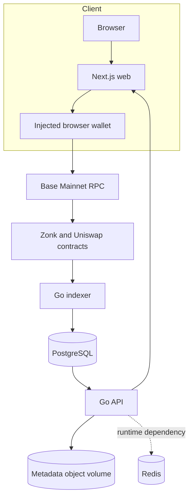

## Source-of-truth boundaries

- **Onchain:** token supply, ownership, balances, allowances, curve reserve, quotes, trades, fee liabilities, launch registry, pool selection, graduation, LP ownership, and vault accounting.
- **PostgreSQL:** canonical raw blocks/events plus replayable query projections for tokens, curves, trades, holders, metrics, candles, graduations, and liquidity events.
- **Application metadata:** drafts and stored public images/JSON are offchain; finalization is allowed only after the API finds the matching canonical launch transaction.
- **Redis:** provisioned as a runtime service and configured for the API/indexer, but current request and indexing source code does not use Redis as an authoritative data store.

The indexer and API can be delayed or unavailable without changing onchain balances. Conversely, an indexed record is not a substitute for a transaction-critical contract read.
