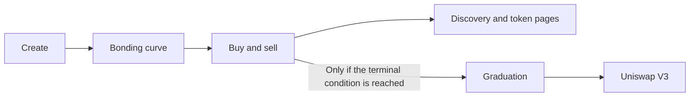

Zonk.fun is a permissionless token launchpad on Base where anyone can create, discover, and trade community tokens through an onchain bonding curve.

<CardGroup cols={2}>
  <Card title="Launch a token" icon="rocket" href="/docs/users/create-token">
    Publish token metadata and confirm the launch from your browser wallet.
  </Card>
  <Card title="Start trading" icon="arrow-right-arrow-left" href="/docs/getting-started/quickstart">
    Connect on Base Mainnet, review a quote, and confirm the transaction.
  </Card>
  <Card title="Understand the protocol" icon="chart-line" href="/docs/protocol/bonding-curve">
    Learn how the curve, fees, graduation, and permanent liquidity custody work.
  </Card>
  <Card title="Build with Zonk" icon="code" href="/docs/developers/overview">
    Explore the frontend, indexed API, event pipeline, database, and contract SDK.
  </Card>
</CardGroup>

## Token lifecycle

- **Base-native:** the production application uses Base Mainnet, chain ID `8453`.
- **Permissionless:** launching does not require protocol approval.
- **Non-custodial wallet execution:** RainbowKit, wagmi, and viem connect an injected browser wallet. Zonk.fun does not receive your wallet keys.
- **Onchain financial state:** token supply, curve reserves, trades, fee liabilities, and graduation settlement are contract state.
- **Indexed discovery:** the indexer and PostgreSQL make confirmed chain activity queryable by the web application.

<Warning>
  Tokens are risky and can lose all market value. A launch is not an endorsement, and graduation is not guaranteed. Always verify the network, contract, amounts, and slippage before signing.
</Warning>

<Card title="Open the production app" icon="external-link" href="https://zonk.fun">
  Use Zonk.fun on Base Mainnet.
</Card>
