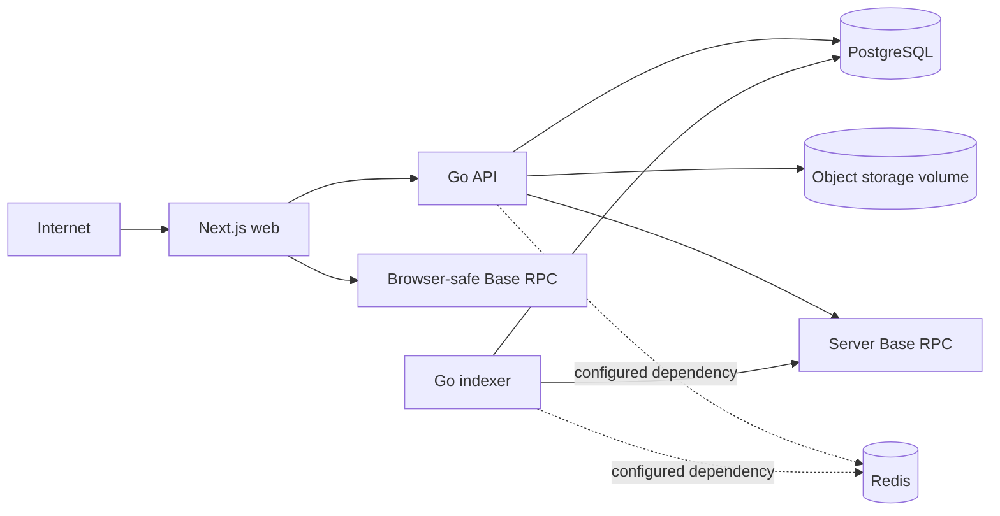

Compose publishes web and API only on loopback in the repository topology, leaving public ingress and TLS to external infrastructure. PostgreSQL is loopback-only and Redis is not host-published. Persistent volumes hold PostgreSQL, Redis, and metadata objects.

The public frontend RPC is safe to expose but rate-limited. Production API/indexer traffic should use a dedicated server-side Base Mainnet RPC. Server RPC URLs can contain credentials and must never be copied into `NEXT_PUBLIC_` variables.

No private hostnames, addresses, SSH details, or credentials are part of the public architecture contract.
