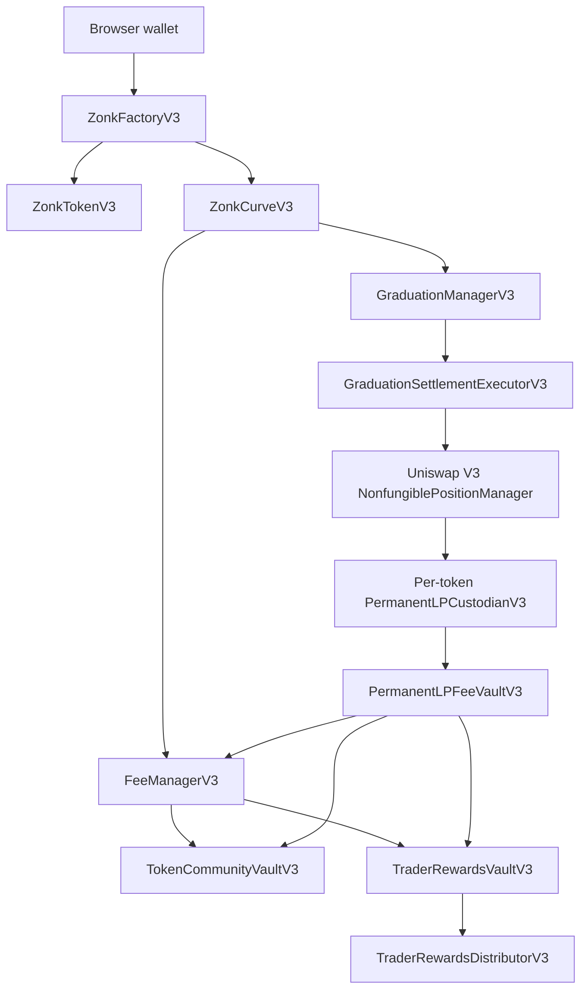

The factory owns the launch registry and creates internal `TokenDeployerV3` and `CurveDeployerV3` components in its constructor. The manager reserves the token/WETH pool during launch, before curve trading. The curve authenticates the graduation call. The settlement executor mints one full-range NFT directly to a newly deployed custodian.

One-time bootstrap authorities bind the deployed graph and are consumed. Current Base Mainnet deployment evidence records completed Ownable2Step ownership handoff for the owner-controlled fee/community/reward administration contracts.
