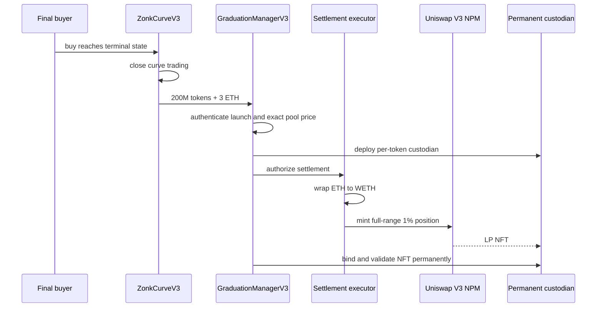

Graduation is the one-way transition from internal curve trading to external Uniswap V3 liquidity. A token graduates only when a buy reaches both of these exact onchain conditions:

```text
soldSupply == 800,000,000 tokens
activeEthReserve == 3 ETH
```

For an empty curve, the exact gross input that produces 3 ETH after the 1% fee is `3.030303030303030303 ETH`. With intervening sells, graduation still depends on the exact current net reserve and sold supply, not cumulative volume.

## Atomic settlement



The manager requires the launch's reserved canonical pool to remain at the exact initialized terminal price before minting. Settlement uses the full-range ticks `-887200` through `887200`. Integer liquidity math uses nearly all 200M tokens and 3 ETH; any defined rounding residual is sent to an ownerless per-launch residual escrow with no withdrawal path.

After the transaction, curve `buy` and `sell` revert with trading closed. Swaps occur through the external pool.

<Warning>
  The repository implements and tests this graduation path. Repository evidence does not, by itself, prove that a production token has completed an end-to-end Mainnet graduation, so this documentation makes no such claim.
</Warning>
