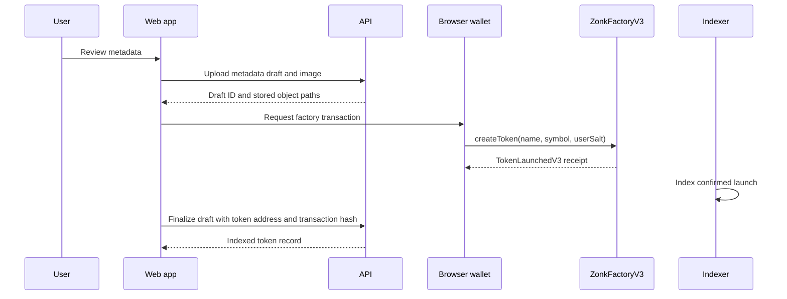

The launch form creates a metadata draft first, then asks your browser wallet to call `ZonkFactoryV3.createToken` on Base Mainnet.

## Fields

| Field | Requirement |
| --- | --- |
| Token name | Required; 1–64 UTF-8 bytes |
| Symbol | Required; shown uppercase; 1–16 UTF-8 bytes |
| About | Optional; up to 1,000 UTF-8 bytes |
| Website | Optional HTTP or HTTPS URL |
| X / Twitter | Optional `x.com` or `twitter.com` URL |
| Telegram | Optional `t.me` or `telegram.me` URL |
| Discord | Optional `discord.gg` or `discord.com` URL |
| Image | Required PNG, JPEG, WebP, or GIF; upload up to 5 MB, or use a public HTTPS image URL |
| Dev buy | Optional ETH amount for a separate curve buy after launch |

The initial supply is not user-selectable. Every V3 launch has a fixed supply of `1,000,000,000` tokens with 18 decimals.

## Confirmed launch sequence

The factory atomically deploys and registers the ERC-20 token and its dedicated curve, places the full supply in the curve, registers fee and graduation relationships, and reserves the canonical token/WETH pool.

## Optional dev buy

A dev buy is a normal protected buy by the creator after the launch receipt is confirmed and metadata is finalized. It requires a **separate wallet confirmation**, uses a fresh curve quote, and can fail or be rejected without undoing the token creation. The current UI applies 1% slippage protection to this buy and limits the entered amount to the exact maximum gross needed by an empty curve.

<Warning>
  Review the name and symbol carefully. The factory rejects duplicate creator/name/symbol definitions, and deployed token identity cannot be edited through the launch form.
</Warning>
