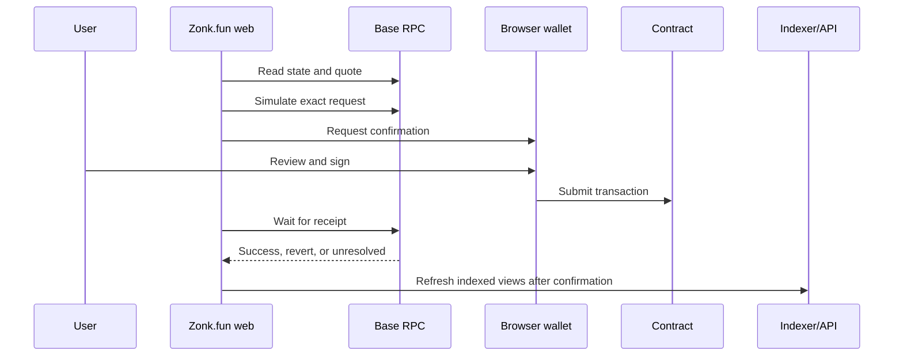

Each write includes the Zonk.fun ERC-8021 Builder Code data suffix. The suffix attributes the transaction but does not change the original contract call, value, quote, fees, or slippage settings.

The UI keeps a submitted trade pending until a definitive receipt is available. If confirmation times out or a transaction may have been replaced, recovery checks the original sender and nonce. Submitting a duplicate while the result is unknown can create additional loss, so the UI blocks a new trade unless the user explicitly abandons recovery.

<Tip>
  BaseScan is the independent place to inspect a transaction hash, status, sender, destination, value, logs, and block confirmation.
</Tip>
